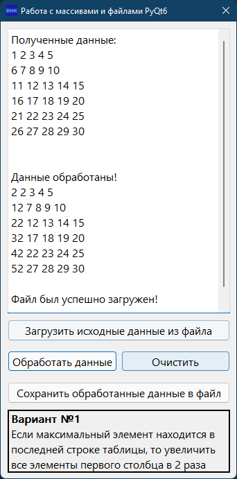
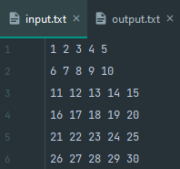
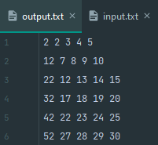
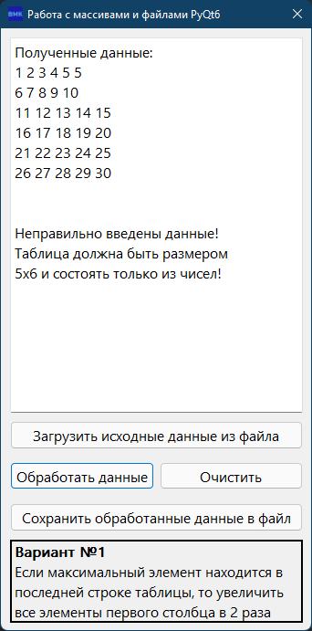
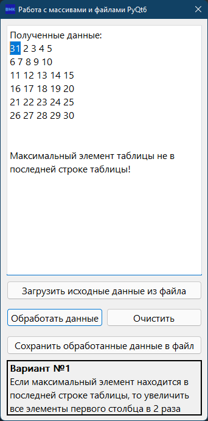

# BMK01_File_Manipulations

## Современное кроссплатформенное программирование

### Лабораторная работа №5. Работа с файлами и ОС в PyQt6

Имеется двухмерный массив 5x6 целых чисел, загружаемый из файла. Необходимо создать программу, реализующую указанное в
варианте задание. Программа должна:

1) считать из входного файла «input.txt» данные (значения массива) и вывести их на экран – кнопка «Загрузить исходные
   данные из файла»;
2) выполнить задание варианта: получить измененный массив (выходные данные) – кнопка «Обработать данные»;
3) вывести выходные данные (содержимое измененного массива) на экран и сохранить их в выходной файл «output.txt» -
   кнопка «Сохранить обработанные данные в файл».

### Вариант №1

Если максимальный элемент находится в последней строке таблицы, то увеличить все элементы первого столбца в 2 раза

## Решение

## Считанный из файла массив

## Записанный в файл массив

## Ошибка №1

## Ошибка №2

